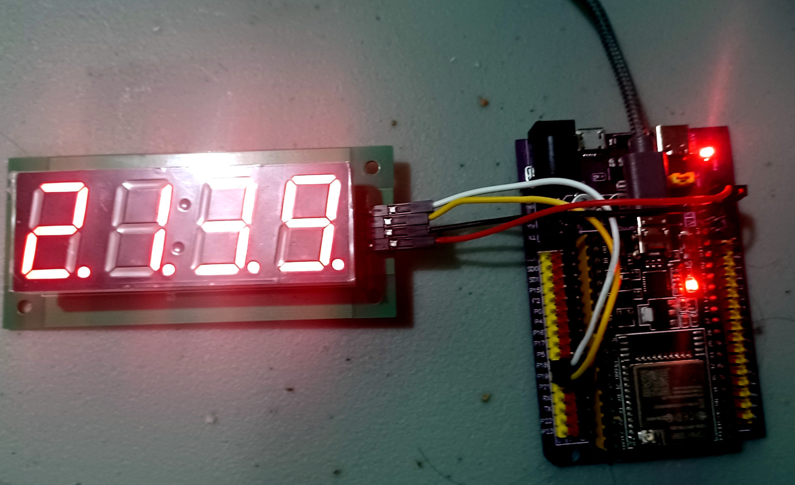

# Demo Project: ESP-32 tm1637 driver LED library for the ESP-IDF

## Introduction

This is a demo project for a library to control TM1637 LED 7-segment display using the ESP-32 IDF toolchain [ESP-IDF](https://github.com/espressif/esp-idf).

Please note that this is actually a demo project. The library is in the components folder.



## Features

 * Display numbers
 * Display raw segment data
 * Scrolling text
 * Simplified interface
 * C++ Implementation


## Software required

esp-idf v5.1.2 or later.

# Installation


```Shell
git clone https://github.com/cfrankb/esp32-tm1637plus-cpp
cd esp32-tm1637plus-cpp/
idf.py set-target {esp32/esp32s2/esp32s3/esp32c3}
idf.py menuconfig
idf.py flash
```

## Suggested wiring for the TM1637 LED display

| TM1637   | wirecolor | GPIO Pin   |
| -------- | --------- | ---------- |
| CLK      | white     | 18         |
| DIO      | yellow    | 19         |
| GRN      | black     | GRN        |
| VCC      | red       | 3.3v or 5v |


## Tested hardware

| Part #   | Size      | Pins       |
| -------- | --------- | ---------- |
| 5643BS-1 | 0.56"     | 12         |
| 8041BS-1 | 0.80"     | 12         |
| 8401BS-1F| 0.80"     | 14         |


## Source Code

The source is available from [GitHub cfrankb/esp32-tm1637plus-cpp](https://github.com/cfrankb/esp32-tm1637plus-cpp).

## License / acknowledgement

The code in this project is licensed under the MIT license - see LICENSE for details.

Initial idea based on the Micropython implementation library, written by Mike Causer Copyright (c) 2016
https://github.com/mcauser/micropython-tm1637

The project is also based in part on this ESP-32 ESP-IDF library: https://github.com/petrows/esp-32-tm1637
