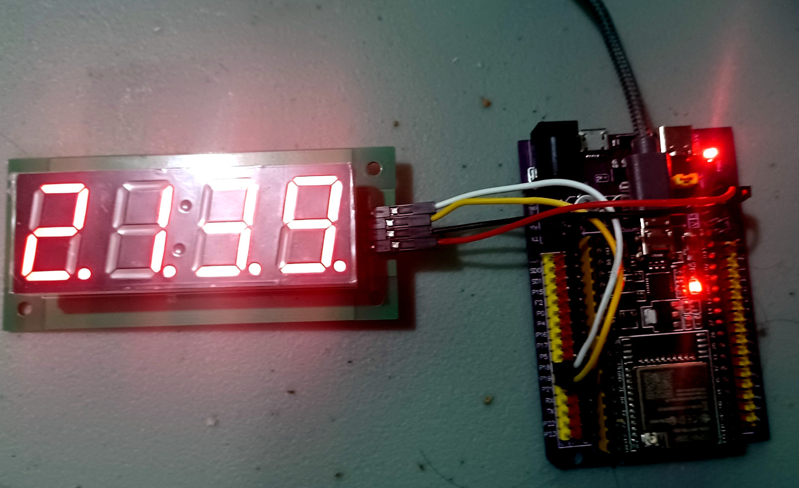

# ESP-32 tm1637 driven LED library for the ESP-IDF

## Introduction

This is an library of control TM1637 LED 7-segment display using ESP-32 IDF toolchain [ESP-IDF](https://github.com/espressif/esp-idf).



## Features

 * Display numbers
 * Display raw segment data
 * Scrolling text
 * Simplified interface
 * C++ Implementation


# Software required

esp-idf v5.1.2 or later.

# Installation


```Shell
git clone https://github.com/cfrankb/esp32-tm1637plus-cpp
cd esp32-tm1637plus-cpp/
idf.py set-target {esp32/esp32s2/esp32s3/esp32c3}
idf.py menuconfig
idf.py flash
```


## Important notes

This library uses `ets_delay_us()` function to generate i2c-like control sequences. Please note - while using within FreeRTOS task will be blocked while data is transmitted.


## Source Code

The source is available from [GitHub cfrankb/esp32-tm1637plus-cpp](https://github.com/cfrankb/esp32-tm1637plus-cpp).

## License

The code in this project is licensed under the MIT license - see LICENSE for details.

Initial idea based on the Micropython implementation library, written by Mike Causer Copyright (c) 2016

This project is also based in part on: https://github.com/petrows/esp-32-tm1637
